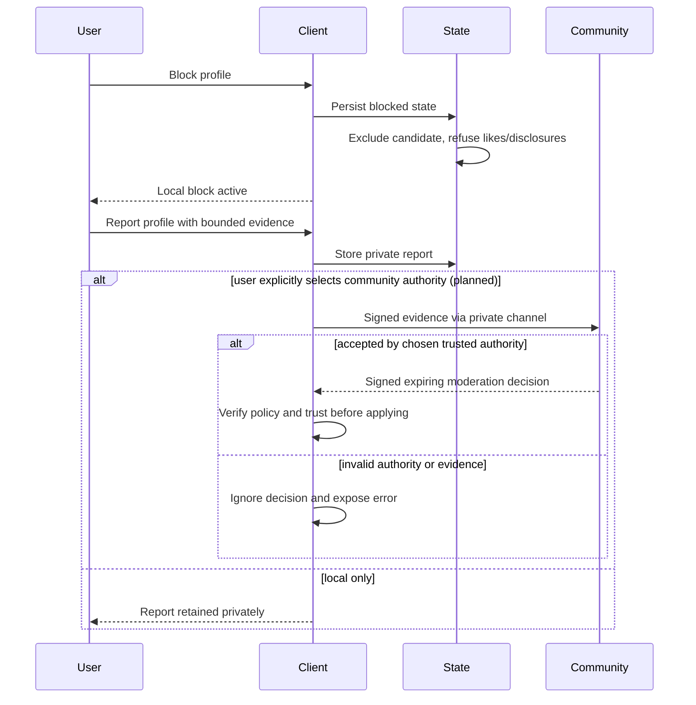

## 10. Blocking and reporting

Milestone: local block and report interfaces. Planned: explicit community report transport and trusted moderation decisions.

```mermaid
sequenceDiagram
    participant User
    participant Client
    participant State
    participant Community
    User->>Client: Block profile
    Client->>State: Persist blocked state
    State->>State: Exclude candidate, refuse likes/disclosures
    Client-->>User: Local block active
    User->>Client: Report profile with bounded evidence
    Client->>State: Store private report
    alt user explicitly selects community authority (planned)
        Client->>Community: Signed evidence via private channel
        alt accepted by chosen trusted authority
            Community-->>Client: Signed expiring moderation decision
            Client->>Client: Verify policy and trust before applying
        else invalid authority or evidence
            Client->>Client: Ignore decision and expose error
        end
    else local only
        Client-->>User: Report retained privately
    end
```
