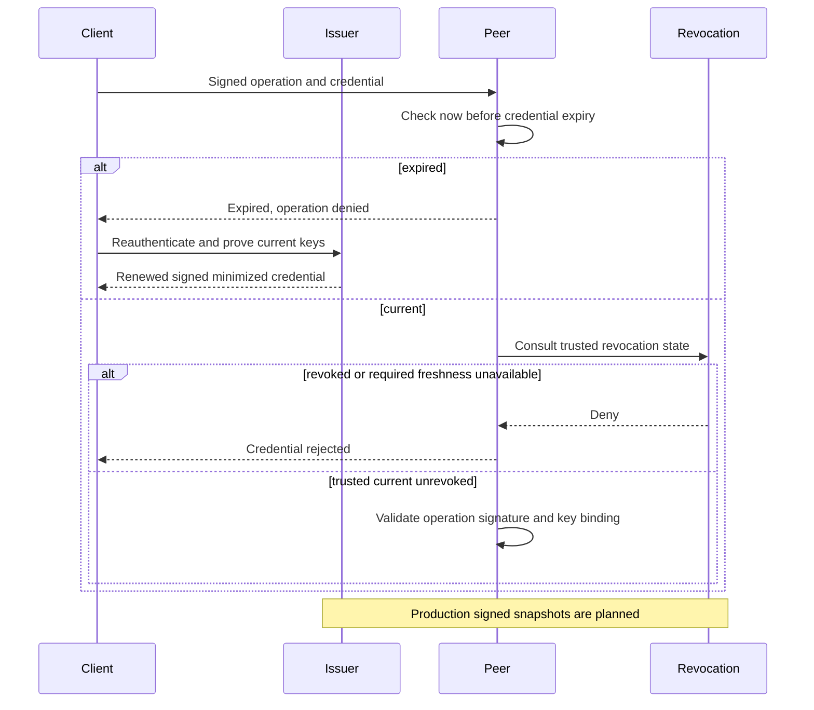

## 11. Credential expiration, renewal and revocation

Milestone: explicit-time expiry and trusted revocation-set validation. Planned: fresh signed snapshot distribution and real renewal adapter.

```mermaid
sequenceDiagram
    participant Client
    participant Issuer
    participant Peer
    participant Revocation
    Client->>Peer: Signed operation and credential
    Peer->>Peer: Check now before credential expiry
    alt expired
        Peer-->>Client: Expired, operation denied
        Client->>Issuer: Reauthenticate and prove current keys
        Issuer-->>Client: Renewed signed minimized credential
    else current
        Peer->>Revocation: Consult trusted revocation state
        alt revoked or required freshness unavailable
            Revocation-->>Peer: Deny
            Peer-->>Client: Credential rejected
        else trusted current unrevoked
            Peer->>Peer: Validate operation signature and key binding
        end
    end
    Note over Issuer,Revocation: Production signed snapshots are planned
```
