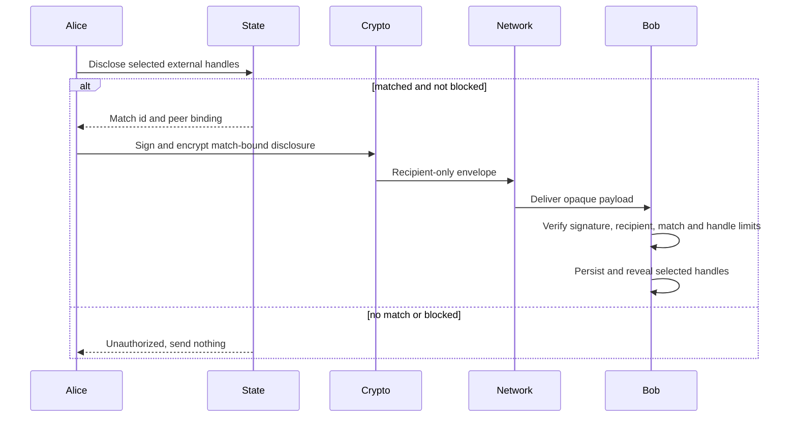

## 9. Explicit external contact disclosure

Milestone target: match gate, encrypted contact payload and recipient validation.

```mermaid
sequenceDiagram
    participant Alice
    participant State
    participant Crypto
    participant Network
    participant Bob
    Alice->>State: Disclose selected external handles
    alt matched and not blocked
        State-->>Alice: Match id and peer binding
        Alice->>Crypto: Sign and encrypt match-bound disclosure
        Crypto->>Network: Recipient-only envelope
        Network->>Bob: Deliver opaque payload
        Bob->>Bob: Verify signature, recipient, match and handle limits
        Bob->>Bob: Persist and reveal selected handles
    else no match or blocked
        State-->>Alice: Unauthorized, send nothing
    end
```
