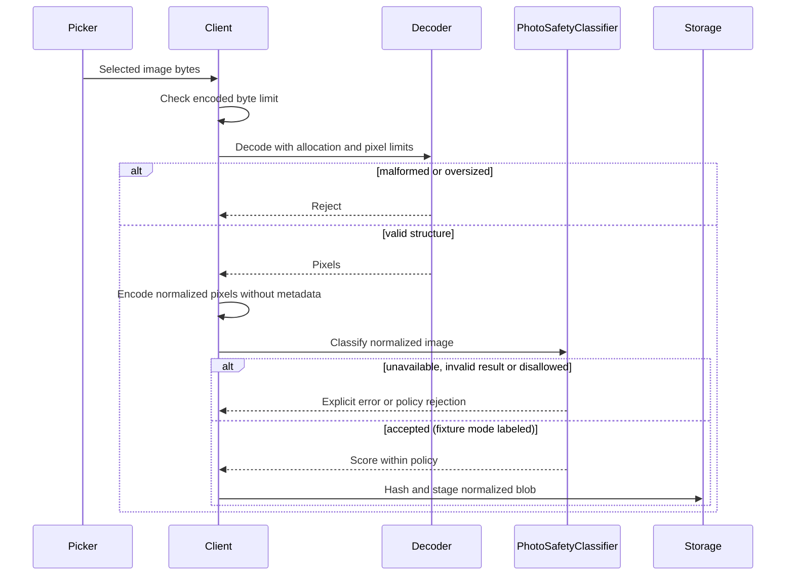

## 3. Local photo validation before upload

Milestone: decode, limits, metadata normalization and deterministic test classifier. Planned: actual mobile model inference.

```mermaid
sequenceDiagram
    participant Picker
    participant Client
    participant Decoder
    participant Classifier as PhotoSafetyClassifier
    participant Storage
    Picker->>Client: Selected image bytes
    Client->>Client: Check encoded byte limit
    Client->>Decoder: Decode with allocation and pixel limits
    alt malformed or oversized
        Decoder-->>Client: Reject
    else valid structure
        Decoder-->>Client: Pixels
        Client->>Client: Encode normalized pixels without metadata
        Client->>Classifier: Classify normalized image
        alt unavailable, invalid result or disallowed
            Classifier-->>Client: Explicit error or policy rejection
        else accepted (fixture mode labeled)
            Classifier-->>Client: Score within policy
            Client->>Storage: Hash and stage normalized blob
        end
    end
```
