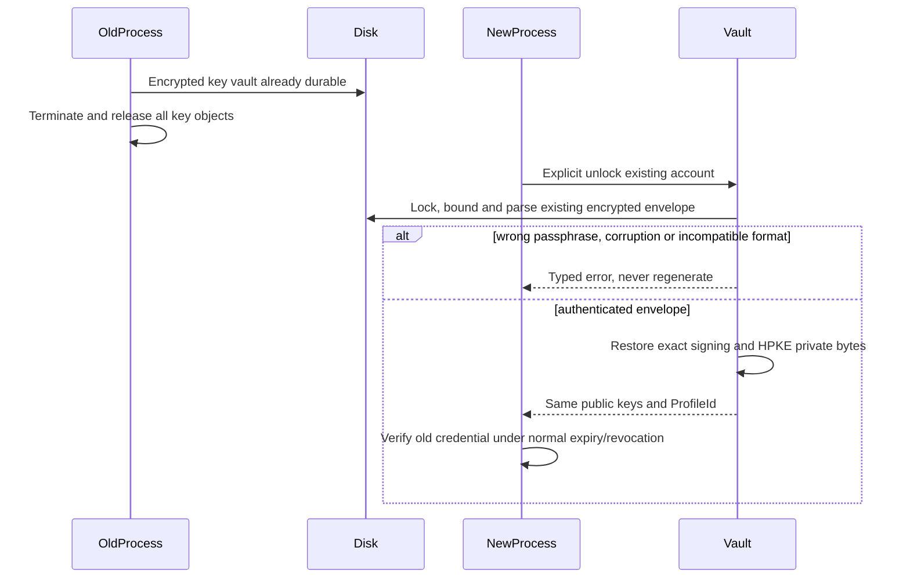

## Sequence 2: Restore after complete process restart

Rust target includes fresh process proof. Credential renewal is not implicit.

```mermaid
sequenceDiagram
    participant OldProcess
    participant Disk
    participant NewProcess
    participant Vault
    OldProcess->>Disk: Encrypted key vault already durable
    OldProcess->>OldProcess: Terminate and release all key objects
    NewProcess->>Vault: Explicit unlock existing account
    Vault->>Disk: Lock, bound and parse existing encrypted envelope
    alt wrong passphrase, corruption or incompatible format
        Vault-->>NewProcess: Typed error, never regenerate
    else authenticated envelope
        Vault->>Vault: Restore exact signing and HPKE private bytes
        Vault-->>NewProcess: Same public keys and ProfileId
        NewProcess->>NewProcess: Verify old credential under normal expiry/revocation
    end
```
