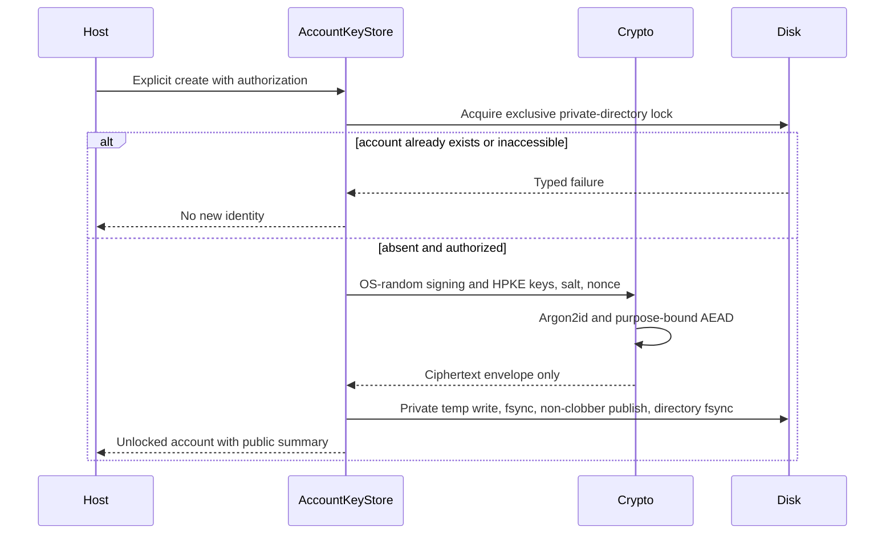

## Sequence 1: First account creation and secure storage

Rust portable vault target. Native protection adapters planned.

```mermaid
sequenceDiagram
    participant Host
    participant Vault as AccountKeyStore
    participant Crypto
    participant Disk
    Host->>Vault: Explicit create with authorization
    Vault->>Disk: Acquire exclusive private-directory lock
    alt account already exists or inaccessible
        Disk-->>Vault: Typed failure
        Vault-->>Host: No new identity
    else absent and authorized
        Vault->>Crypto: OS-random signing and HPKE keys, salt, nonce
        Crypto->>Crypto: Argon2id and purpose-bound AEAD
        Crypto-->>Vault: Ciphertext envelope only
        Vault->>Disk: Private temp write, fsync, non-clobber publish, directory fsync
        Vault-->>Host: Unlocked account with public summary
    end
```
