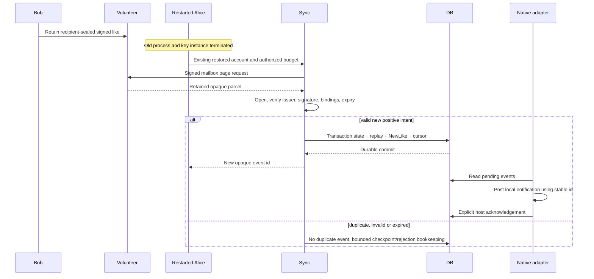

## Sequence 4: Offline like and local notification event

Rust outbox and network target, actual OS notification display planned.

```mermaid
sequenceDiagram
    participant Bob
    participant Volunteer
    participant Alice as Restarted Alice
    participant Sync
    participant DB
    participant Adapter as Native adapter
    Bob->>Volunteer: Retain recipient-sealed signed like
    Note over Alice: Old process and key instance terminated
    Alice->>Sync: Existing restored account and authorized budget
    Sync->>Volunteer: Signed mailbox page request
    Volunteer-->>Sync: Retained opaque parcel
    Sync->>Sync: Open, verify issuer, signature, bindings, expiry
    alt valid new positive intent
        Sync->>DB: Transaction state + replay + NewLike + cursor
        DB-->>Sync: Durable commit
        Sync-->>Alice: New opaque event id
        Adapter->>DB: Read pending events
        Adapter->>Adapter: Post local notification using stable id
        Adapter->>DB: Explicit host acknowledgement
    else duplicate, invalid or expired
        Sync->>DB: No duplicate event, bounded checkpoint/rejection bookkeeping
    end
```
