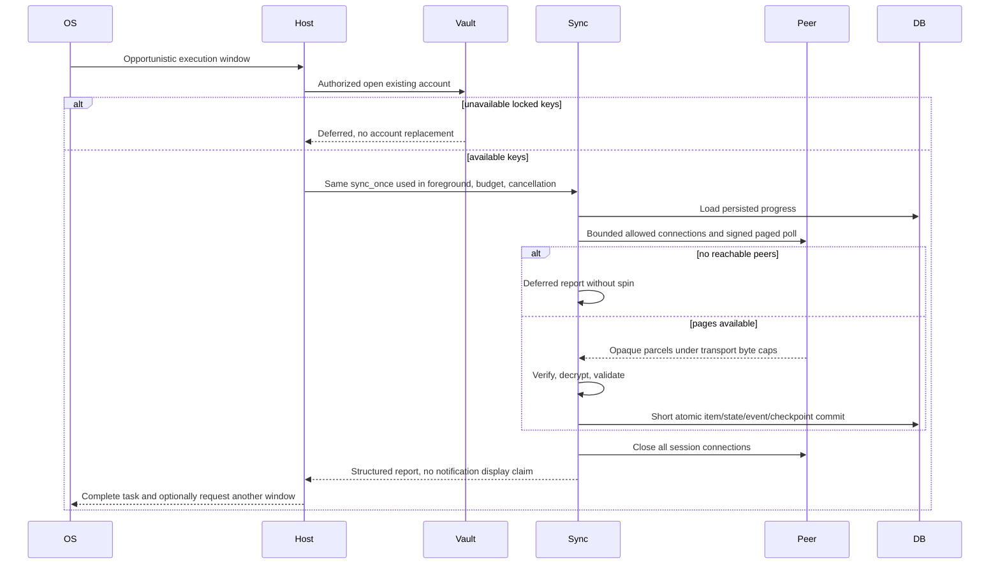

## Sequence 3: OS-triggered finite P2P synchronization

OS scheduler planned host adapter, actual service Rust target.

```mermaid
sequenceDiagram
    participant OS
    participant Host
    participant Vault
    participant Sync
    participant Peer
    participant DB
    OS->>Host: Opportunistic execution window
    Host->>Vault: Authorized open existing account
    alt unavailable locked keys
        Vault-->>Host: Deferred, no account replacement
    else available keys
        Host->>Sync: Same sync_once used in foreground, budget, cancellation
        Sync->>DB: Load persisted progress
        Sync->>Peer: Bounded allowed connections and signed paged poll
        alt no reachable peers
            Sync->>Sync: Deferred report without spin
        else pages available
            Peer-->>Sync: Opaque parcels under transport byte caps
            Sync->>Sync: Verify, decrypt, validate
            Sync->>DB: Short atomic item/state/event/checkpoint commit
        end
        Sync->>Peer: Close all session connections
        Sync-->>Host: Structured report, no notification display claim
        Host-->>OS: Complete task and optionally request another window
    end
```
