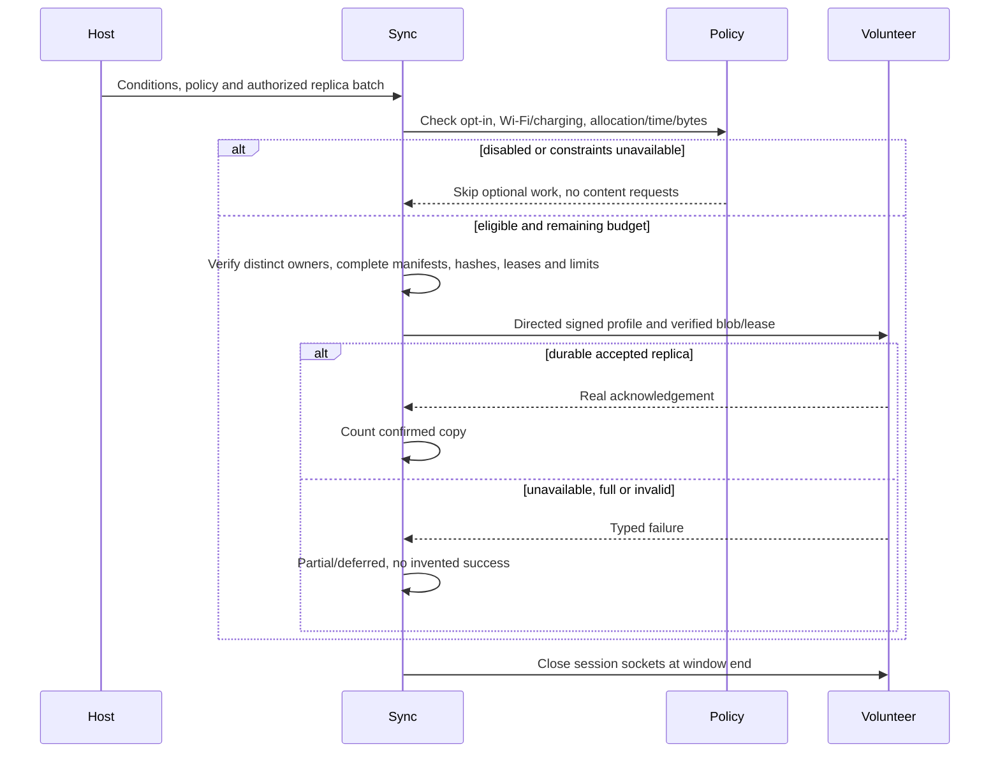

## Sequence 5: Voluntary cooperation in temporary window

M2 target forwards existing authorized replicas. Inbound mobile provider mode planned.

```mermaid
sequenceDiagram
    participant Host
    participant Sync
    participant Policy
    participant Volunteer
    Host->>Sync: Conditions, policy and authorized replica batch
    Sync->>Policy: Check opt-in, Wi-Fi/charging, allocation/time/bytes
    alt disabled or constraints unavailable
        Policy-->>Sync: Skip optional work, no content requests
    else eligible and remaining budget
        Sync->>Sync: Verify distinct owners, complete manifests, hashes, leases and limits
        Sync->>Volunteer: Directed signed profile and verified blob/lease
        alt durable accepted replica
            Volunteer-->>Sync: Real acknowledgement
            Sync->>Sync: Count confirmed copy
        else unavailable, full or invalid
            Volunteer-->>Sync: Typed failure
            Sync->>Sync: Partial/deferred, no invented success
        end
    end
    Sync->>Volunteer: Close session sockets at window end
```
