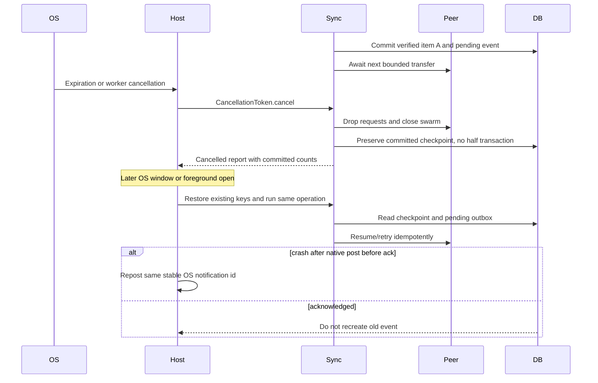

## Sequence 6: Cancellation and recovery

Rust target commits per item and returns boundedly.

```mermaid
sequenceDiagram
    participant OS
    participant Host
    participant Sync
    participant Peer
    participant DB
    Sync->>DB: Commit verified item A and pending event
    Sync->>Peer: Await next bounded transfer
    OS->>Host: Expiration or worker cancellation
    Host->>Sync: CancellationToken.cancel
    Sync->>Peer: Drop requests and close swarm
    Sync->>DB: Preserve committed checkpoint, no half transaction
    Sync-->>Host: Cancelled report with committed counts
    Note over Host: Later OS window or foreground open
    Host->>Sync: Restore existing keys and run same operation
    Sync->>DB: Read checkpoint and pending outbox
    Sync->>Peer: Resume/retry idempotently
    alt crash after native post before ack
        Host->>Host: Repost same stable OS notification id
    else acknowledged
        DB-->>Host: Do not recreate old event
    end
```
