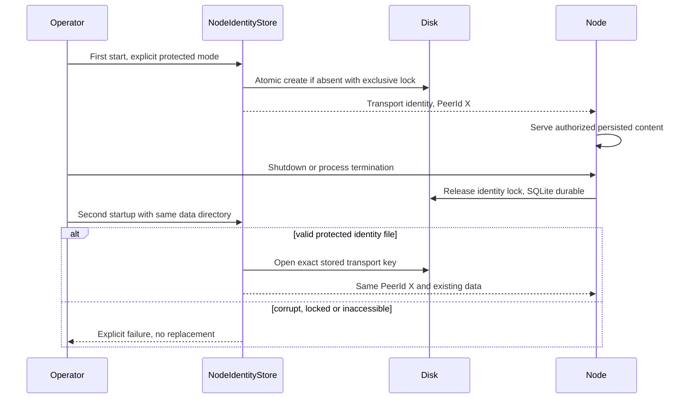

## Sequence 7: Stable volunteer restart

Rust filesystem-protected transport store target.

```mermaid
sequenceDiagram
    participant Operator
    participant Store as NodeIdentityStore
    participant Disk
    participant Node
    Operator->>Store: First start, explicit protected mode
    Store->>Disk: Atomic create if absent with exclusive lock
    Store-->>Node: Transport identity, PeerId X
    Node->>Node: Serve authorized persisted content
    Operator->>Node: Shutdown or process termination
    Node->>Disk: Release identity lock, SQLite durable
    Operator->>Store: Second startup with same data directory
    alt valid protected identity file
        Store->>Disk: Open exact stored transport key
        Store-->>Node: Same PeerId X and existing data
    else corrupt, locked or inaccessible
        Store-->>Operator: Explicit failure, no replacement
    end
```
