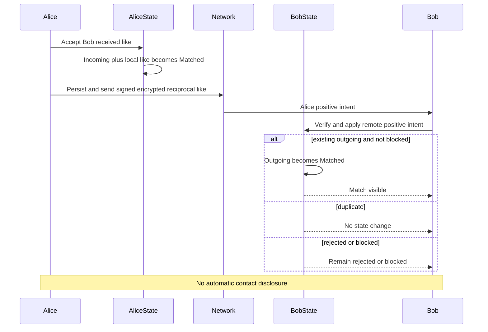

## 8. Mutual matching

Milestone: domain state machine and actual positive intent exchange. Match visibility waits for both authenticated intents.

```mermaid
sequenceDiagram
    participant Alice
    participant AliceState
    participant Network
    participant BobState
    participant Bob
    Alice->>AliceState: Accept Bob received like
    AliceState->>AliceState: Incoming plus local like becomes Matched
    Alice->>Network: Persist and send signed encrypted reciprocal like
    Network->>Bob: Alice positive intent
    Bob->>BobState: Verify and apply remote positive intent
    alt existing outgoing and not blocked
        BobState->>BobState: Outgoing becomes Matched
        BobState-->>Bob: Match visible
    else duplicate
        BobState-->>Bob: No state change
    else rejected or blocked
        BobState-->>Bob: Remain rejected or blocked
    end
    Note over Alice,Bob: No automatic contact disclosure
```
