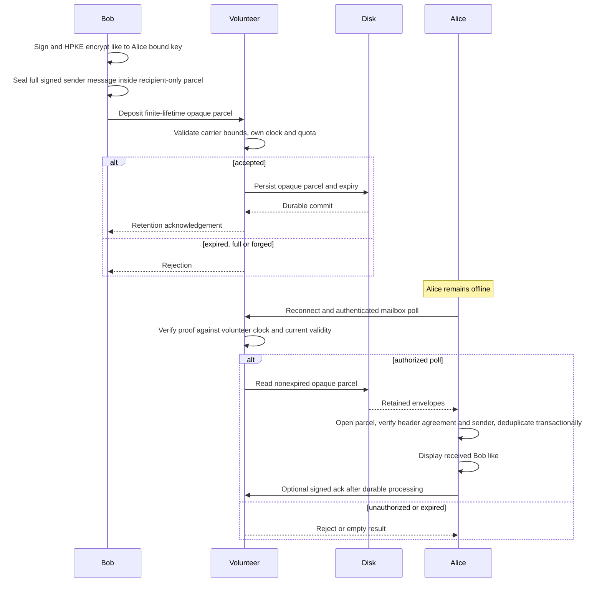

## 7. Offline like and later retrieval

Milestone target: durable volunteer ciphertext plus recipient retrieval. Planned production challenge freshness is tracked explicitly.

```mermaid
sequenceDiagram
    participant Bob
    participant Volunteer
    participant Disk
    participant Alice
    Bob->>Bob: Sign and HPKE encrypt like to Alice bound key
    Bob->>Bob: Seal full signed sender message inside recipient-only parcel
    Bob->>Volunteer: Deposit finite-lifetime opaque parcel
    Volunteer->>Volunteer: Validate carrier bounds, own clock and quota
    alt accepted
        Volunteer->>Disk: Persist opaque parcel and expiry
        Disk-->>Volunteer: Durable commit
        Volunteer-->>Bob: Retention acknowledgement
    else expired, full or forged
        Volunteer-->>Bob: Rejection
    end
    Note over Alice: Alice remains offline
    Alice->>Volunteer: Reconnect and authenticated mailbox poll
    Volunteer->>Volunteer: Verify proof against volunteer clock and current validity
    alt authorized poll
        Volunteer->>Disk: Read nonexpired opaque parcel
        Disk-->>Alice: Retained envelopes
        Alice->>Alice: Open parcel, verify header agreement and sender, deduplicate transactionally
        Alice->>Alice: Display received Bob like
        Alice->>Volunteer: Optional signed ack after durable processing
    else unauthorized or expired
        Volunteer-->>Alice: Reject or empty result
    end
```
