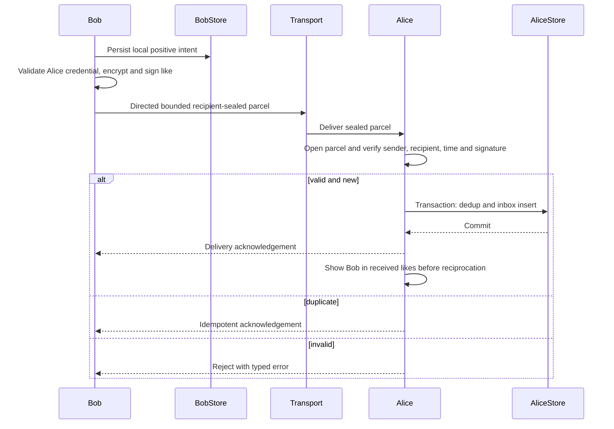

## 6. Like to online user

Milestone target: signed HPKE payload over actual directed RPC. No public broadcast.

```mermaid
sequenceDiagram
    participant Bob
    participant BobStore
    participant Transport
    participant Alice
    participant AliceStore
    Bob->>BobStore: Persist local positive intent
    Bob->>Bob: Validate Alice credential, encrypt and sign like
    Bob->>Transport: Directed bounded recipient-sealed parcel
    Transport->>Alice: Deliver sealed parcel
    Alice->>Alice: Open parcel and verify sender, recipient, time and signature
    alt valid and new
        Alice->>AliceStore: Transaction: dedup and inbox insert
        AliceStore-->>Alice: Commit
        Alice-->>Bob: Delivery acknowledgement
        Alice->>Alice: Show Bob in received likes before reciprocation
    else duplicate
        Alice-->>Bob: Idempotent acknowledgement
    else invalid
        Alice-->>Bob: Reject with typed error
    end
```
