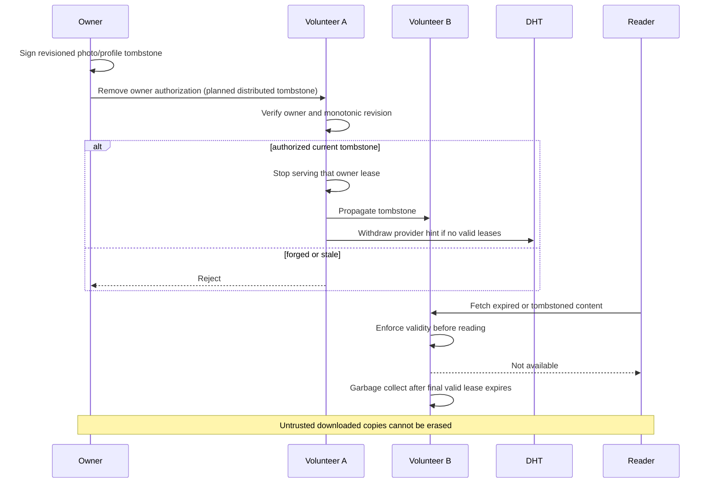

## 12. Photo removal, tombstones and expiration

Milestone: local lease expiration and storage removal. Planned: signed monotonic tombstone propagation and stale-record suppression.

```mermaid
sequenceDiagram
    participant Owner
    participant A as Volunteer A
    participant B as Volunteer B
    participant DHT
    participant Reader
    Owner->>Owner: Sign revisioned photo/profile tombstone
    Owner->>A: Remove owner authorization (planned distributed tombstone)
    A->>A: Verify owner and monotonic revision
    alt authorized current tombstone
        A->>A: Stop serving that owner lease
        A->>B: Propagate tombstone
        A->>DHT: Withdraw provider hint if no valid leases
    else forged or stale
        A-->>Owner: Reject
    end
    Reader->>B: Fetch expired or tombstoned content
    B->>B: Enforce validity before reading
    B-->>Reader: Not available
    B->>B: Garbage collect after final valid lease expires
    Note over Owner,Reader: Untrusted downloaded copies cannot be erased
```
