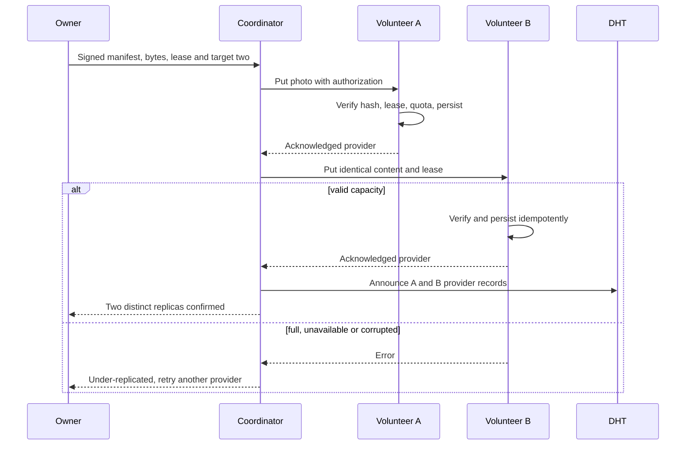

## 4. Photograph replication

Milestone: distinct real local nodes, hash checking, retained leases. Planned: periodic repair and diverse provider placement.

```mermaid
sequenceDiagram
    participant Owner
    participant Coordinator
    participant A as Volunteer A
    participant B as Volunteer B
    participant DHT
    Owner->>Coordinator: Signed manifest, bytes, lease and target two
    Coordinator->>A: Put photo with authorization
    A->>A: Verify hash, lease, quota, persist
    A-->>Coordinator: Acknowledged provider
    Coordinator->>B: Put identical content and lease
    alt valid capacity
        B->>B: Verify and persist idempotently
        B-->>Coordinator: Acknowledged provider
        Coordinator->>DHT: Announce A and B provider records
        Coordinator-->>Owner: Two distinct replicas confirmed
    else full, unavailable or corrupted
        B-->>Coordinator: Error
        Coordinator-->>Owner: Under-replicated, retry another provider
    end
```
