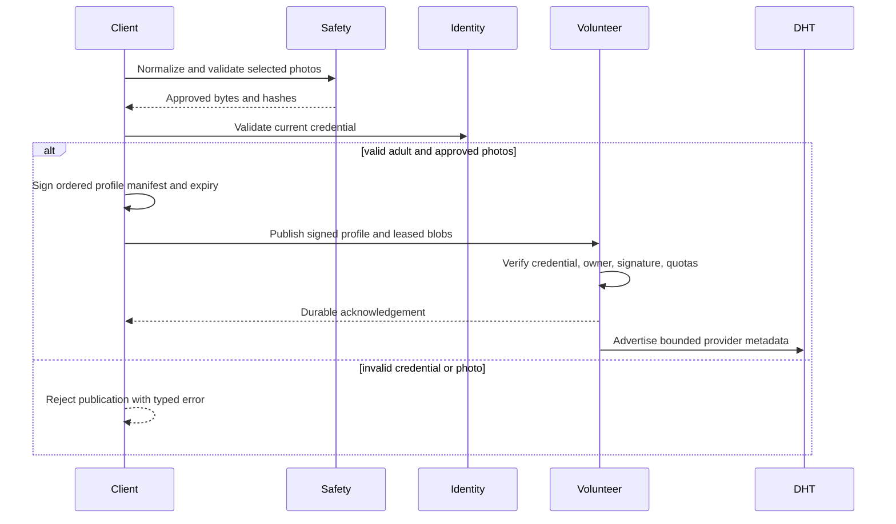

## 2. Profile creation and publication

Milestone target: signed profile and actual directed volunteer transfer. Planned: global discovery policy and durable DHT publication renewal.

```mermaid
sequenceDiagram
    participant Client
    participant Safety
    participant Identity
    participant Volunteer
    participant DHT
    Client->>Safety: Normalize and validate selected photos
    Safety-->>Client: Approved bytes and hashes
    Client->>Identity: Validate current credential
    alt valid adult and approved photos
        Client->>Client: Sign ordered profile manifest and expiry
        Client->>Volunteer: Publish signed profile and leased blobs
        Volunteer->>Volunteer: Verify credential, owner, signature, quotas
        Volunteer-->>Client: Durable acknowledgement
        Volunteer->>DHT: Advertise bounded provider metadata
    else invalid credential or photo
        Client-->>Client: Reject publication with typed error
    end
```
