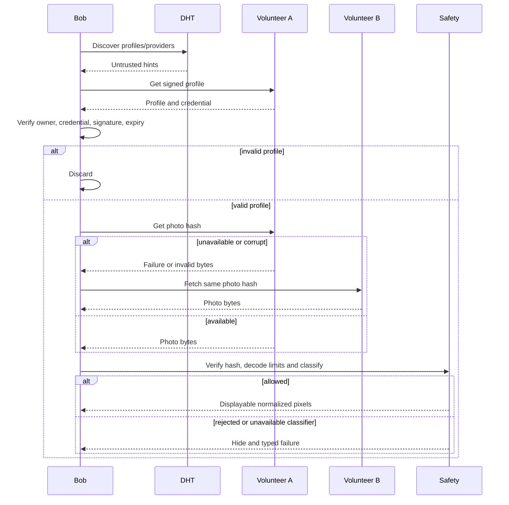

## 5. Discovery and image retrieval

Milestone target: actual network profile discovery and volunteer image retrieval while owner offline. Planned: selective geographic DHT indexing.

```mermaid
sequenceDiagram
    participant Bob
    participant DHT
    participant A as Volunteer A
    participant B as Volunteer B
    participant Safety
    Bob->>DHT: Discover profiles/providers
    DHT-->>Bob: Untrusted hints
    Bob->>A: Get signed profile
    A-->>Bob: Profile and credential
    Bob->>Bob: Verify owner, credential, signature, expiry
    alt invalid profile
        Bob->>Bob: Discard
    else valid profile
        Bob->>A: Get photo hash
        alt unavailable or corrupt
            A-->>Bob: Failure or invalid bytes
            Bob->>B: Fetch same photo hash
            B-->>Bob: Photo bytes
        else available
            A-->>Bob: Photo bytes
        end
        Bob->>Safety: Verify hash, decode limits and classify
        alt allowed
            Safety-->>Bob: Displayable normalized pixels
        else rejected or unavailable classifier
            Safety-->>Bob: Hide and typed failure
        end
    end
```
