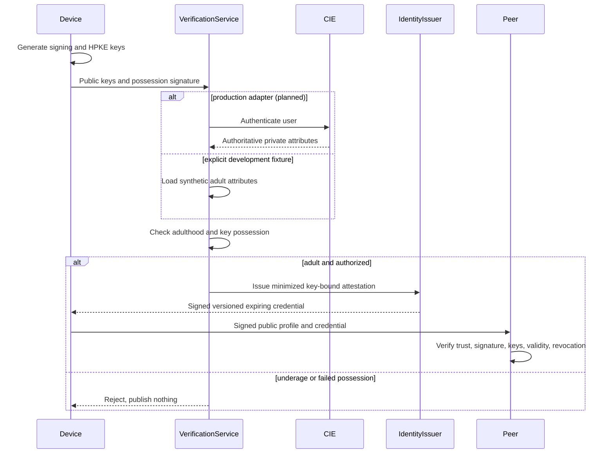

## 1. Registration and CIE credential issuance

Milestone: synthetic development issuance and peer verification. Planned: real CIE adapter and interactive possession challenge.

```mermaid
sequenceDiagram
    participant Device
    participant Service as VerificationService
    participant CIE
    participant Issuer as IdentityIssuer
    participant Peer
    Device->>Device: Generate signing and HPKE keys
    Device->>Service: Public keys and possession signature
    alt production adapter (planned)
        Service->>CIE: Authenticate user
        CIE-->>Service: Authoritative private attributes
    else explicit development fixture
        Service->>Service: Load synthetic adult attributes
    end
    Service->>Service: Check adulthood and key possession
    alt adult and authorized
        Service->>Issuer: Issue minimized key-bound attestation
        Issuer-->>Device: Signed versioned expiring credential
        Device->>Peer: Signed public profile and credential
        Peer->>Peer: Verify trust, signature, keys, validity, revocation
    else underage or failed possession
        Service-->>Device: Reject, publish nothing
    end
```
